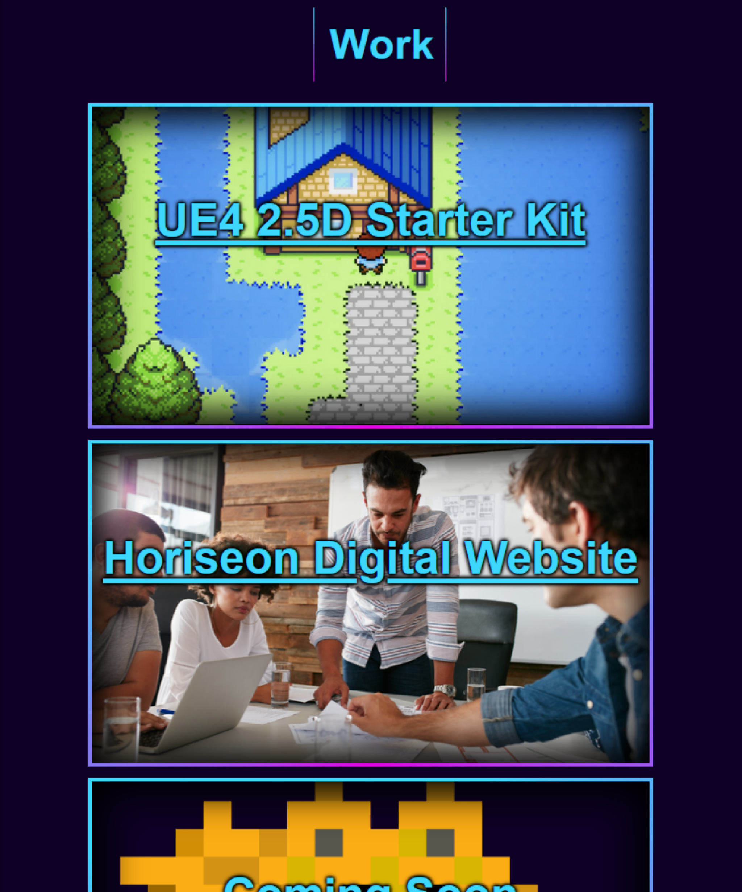

# Portfolio

## Description

I wanted to provide a nicely styled, accessible website where people can access examples of my work, a bit about me, and some contact links to reach out to me.
I wanted the page to look really nice on both desktop and mobile and to showcase my skills with what I've learned so far. It puts the links to all of my created works in one neatly laid-out website. I learned a lot about CSS styling, with both box-shadow and text-shadow, gradients, and how useful variables are.

## Table of Contents

- [Usage](#usage)
- [Credits](#credits)
- [License](#license)
- [Features](#features)

## Usage

Here's a link to my deployed page, go check around:   
[My Portfolio](https://ikonicres.github.io/Portfolio)

On smaller screens like mobile devices or tablets, the page layout switches to a scale that's easier to view, with things cascading vertically down the page in a column. Use the nav links at the top right to jump around the page and the resume link to download my resume directly. The work cards to navigate externally to my work, and hovering over the "contact" section pops up all of the contact links.

## Credits

My ever-abounding curiosity, the TAs, and my great decision to switch to cold brew.

## License

The MIT License (MIT)

Copyright (c) 2023 Michael Ikonomou

Permission is hereby granted, free of charge, to any person obtaining a copy of this software and associated documentation files (the "Software"), to deal in the Software without restriction, including without limitation the rights to use, copy, modify, merge, publish, distribute, sublicense, and/or sell copies of the Software, and to permit persons to whom the Software is furnished to do so, subject to the following conditions:

The above copyright notice and this permission notice shall be included in all copies or substantial portions of the Software.

THE SOFTWARE IS PROVIDED "AS IS", WITHOUT WARRANTY OF ANY KIND, EXPRESS OR IMPLIED, INCLUDING BUT NOT LIMITED TO THE WARRANTIES OF MERCHANTABILITY, FITNESS FOR A PARTICULAR PURPOSE, AND NONINFRINGEMENT. IN NO EVENT SHALL THE AUTHORS OR COPYRIGHT HOLDERS BE LIABLE FOR ANY CLAIM, DAMAGES, OR OTHER LIABILITY, WHETHER IN AN ACTION OF CONTRACT, TORT, OR OTHERWISE, ARISING FROM, OUT OF, OR IN CONNECTION WITH THE SOFTWARE OR THE USE OR OTHER DEALINGS IN THE SOFTWARE.

## Features

Scales to mobile and tablet resolutions well with an alternate layout. Has nav-links to jump around the page and cards that when clicked externally link to my works. Nice gradients and colors to make it easy to look at. You can directly download my resume with the download link. Enjoy!
